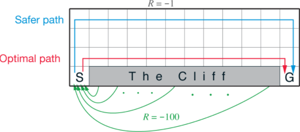
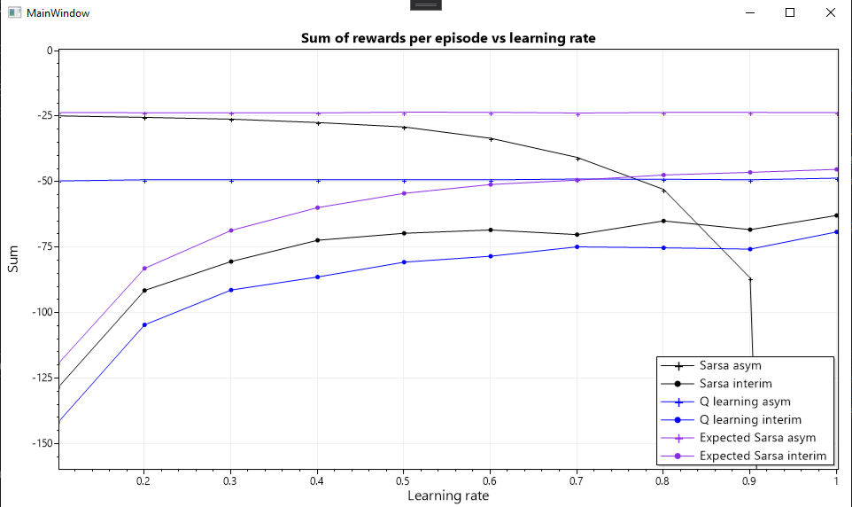

# Cliff walking

From example 6.6 in the RL book:

- 4x12 grid
- agent starts on bottom left (0, 0)
- goal is at bottom right (12, 0)
- agent can move one cell at a time
- reward = -1 for each step taken
- agent cannot step off the grid
- 10 cells at the middle bottom are 'the cliff'. If the agent
  goes here, it gets a reward of -100 and goes back to the start

`CliffWalking.Plots` compares interim & asymptotic performance of various agents
as their learning rates are varied:

# todo
- dynaq 3 step performs worse than 0 step, why?
  - print number of steps per episode. planning should be less than no planning

## notes about dyna 3 being bad
Increasing planning steps to 10 makes performance even worse. It's especially
bad at learning rate = 1. Seems like my simulation is incorrect?

Looking at state-action values:

dynaQ 3 preferring up,left over right
		[2, 1, 0]	UP:     -5.6626760337814712	double
		[2, 1, 1]	RIGHT:  -7.1807255756094515	double
		[2, 1, 2]	DOWN:   -100.17473613169237	double
		[2, 1, 3]	LEFT:   -5.92493991398292	double

changes towards the right side of the map (x=7+ have 'correct' values):
		[7, 1, 0]	-4.4677964176215728	double
		[7, 1, 1]	-4.3675734134155633	double
		[7, 1, 2]	-100.03729984120133	double
		[7, 1, 3]	-6.0988782756956423	double

dyna 0 does same, to lesser degree
		[2, 1, 0]	-7.4128272078823	double
		[2, 1, 1]	-7.4132214200026043	double
		[2, 1, 2]	-54.653394520489975	double
		[2, 1, 3]	-7.3840793298548952	double
dyna 0 numbers are good at x = 4:
		[4, 1, 0]	-6.46197289499577	double
		[4, 1, 1]	-6.4329391334272952	double
		[4, 1, 2]	-64.538718742987413	double
		[4, 1, 3]	-6.45282447048278	double