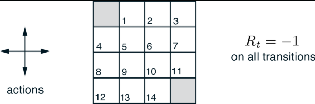

# Policy evaluation with Dynamic Programming (DP)

# The problem

A 'grid world' where there are two terminal states. The reward for each move is
-1. A move off the edge of the world does not change the state, but still incurs
a -1 reward.

This is an episodic problem.

- States                  : [1, 2, ..., 14]
- Actions at all states   : [up, down, left, right]

# Evaluating a random policy

Let the policy be random: all actions are equally likely in all states. We can
evaluate this policy using the dynamic programming loop:

Since the policy is random, $\pi(a|s) = 0.25, \forall (a, s)$

Since the environment is deterministic and the reward is always -1 (for
non-terminal states), $p(s', r | s, a) = 1, \forall (s_{next}, r, a)$

This is an episodic problem, so does not need to be discounted ($\gamma = 0$)

Therefore, each update loop simplifies to:

$V(s) \leftarrow \sum_a{0.25}*[V(s') - 1]$
